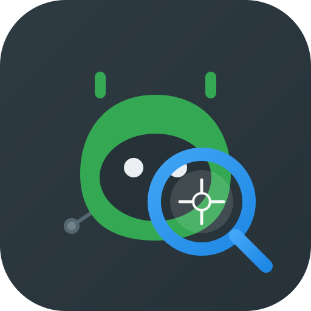
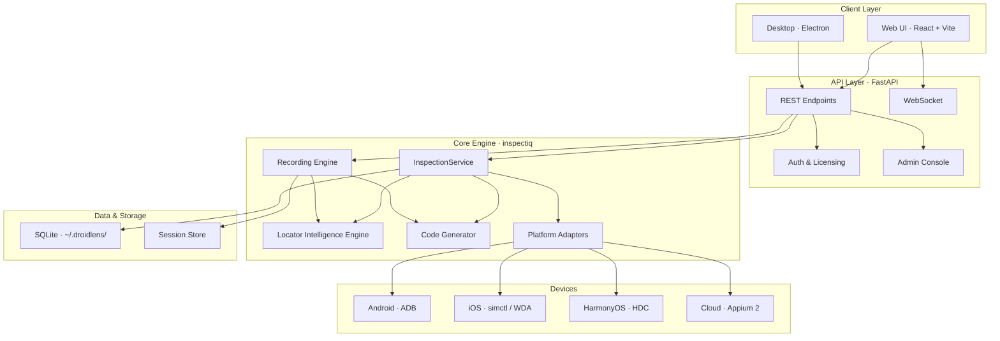

<p align="center">
  
</p>

<p align="center">
  <strong>See. Inspect. Automate.</strong>
</p>

<p align="center">
  <a href="https://opensource.org/licenses/MIT"></a>
  <a href="#"></a>
  <a href="#"></a>
  <a href="#"></a>
  <a href="#"></a>
</p>

<p align="center">
  <a href="https://github.com/kiranckumar2210/DroidLens/stargazers"></a>
</p>

---

**DroidLens** is a professional **multi-platform** UI inspection and automation platform for **Android**, **iOS**, **HarmonyOS**, and **cloud device farms** — built for **Python uiautomator2**, **Appium**, and modern mobile QA workflows. Inspect live devices, simulators, emulators, and offline XML + PNG packages, then generate ranked locators, automation scripts, and recorded test flows from a single IDE-style workspace.

> **Platform setup:** see the full guide at [`docs/PLATFORM-GUIDE.md`](docs/PLATFORM-GUIDE.md) for step-by-step instructions per platform.

---

## Table of Contents

- [Screenshots](#screenshots)
- [Features](#features)
- [Installation](#installation)
- [Quick Start](#quick-start)
- [Supported platforms](#supported-platforms)
- [Architecture](#architecture)
- [Configuration](#configuration)
- [Testing](#testing)
- [Troubleshooting](#troubleshooting)
- [Roadmap](#roadmap)
- [Contributing](#contributing)
- [FAQ](#faq)
- [Changelog](#changelog)
- [Acknowledgements](#acknowledgements)
- [Author](#-author)
- [Support the Project](#-support-the-project)
- [License](#license)

---

## Screenshots

> **Before publishing:** capture screenshots or GIFs following [`docs/screenshots/README.md`](docs/screenshots/README.md), save them under `docs/screenshots/`, then uncomment the gallery below.

<!--
| Dashboard | Live Inspector | Locator Engine |
|-----------|----------------|----------------|
|  |  |  |

| Recording Studio | Code Generator | Admin Panel |
|------------------|----------------|-------------|
|  |  |  |


-->

<p align="center">
  
  <br />
  <em>Screenshot gallery — add PNG/GIF assets to <code>docs/screenshots/</code> and enable the gallery above.</em>
</p>

---

## Features

### Inspection

| Module | Description |
|--------|-------------|
| **Live Inspector** | Real-time UI hierarchy + screenshot sync, element highlight, tree navigation |
| **Multi-platform** | Android (ADB), iOS (Simulator + WDA), HarmonyOS (HDC), cloud Appium hubs |
| **Offline XML Packages** | UIAutomatorViewer-style workflow — paired `.xml` + `.png` files, drag-and-drop |
| **Mock Inspector** | Bundled sample UI per platform (Android, iOS, HarmonyOS) for demos and CI |
| **Device Manager** | Platform picker on Dashboard, USB/WiFi ADB, toolchain status |
| **Cloud device farm** | BrowserStack, Sauce Labs, or any Appium 2 hub via env configuration |

### Locator Intelligence

| Module | Description |
|--------|-------------|
| **Locator Engine** | Resource-ID, uiautomator2, XPath, iOS Predicate/Class Chain, accessibility-id |
| **Scoring & Ranking** | Stability, uniqueness, and maintainability scores |
| **Custom Locator Builder** | Visual and relative rules with live validation |
| **Flutter Support** | Widget detection via semantics and content-desc |

### Automation & Code Generation

| Module | Description |
|--------|-------------|
| **Code Generator** | Python uiautomator2, Appium (multi-language), Page Object Model templates |
| **Recording Studio** | IDE-style three-pane recorder: screenshot · timeline · Monaco code editor |
| **Session Manager** | Live session persistence, recovery, and export |
| **Export** | Locator export (JSON/CSV/MD), XML package export, script export |
| **Offline tools** | XML diff, locator health scan, CI suite validation, migration assistant |
| **CLI** | `scripts/droidlens.sh` — validate locators in CI without a device ([docs/CLI.md](docs/CLI.md)) |

### Platform & Distribution

| Module | Description |
|--------|-------------|
| **Web UI** | React + Vite single-page app |
| **Desktop App** | Electron builds for Linux, macOS, and Windows |
| **REST + WebSocket API** | FastAPI backend with OpenAPI docs |
| **Authentication** | Registration, login, trial, and lifetime licensing |
| **Admin Console** | User management, payments, system settings, feature flags |
| **Configurable Licensing** | Admin-controlled subscription, trial, payment, and feature toggles |

---

## Installation

### Prerequisites

| Requirement | Version | Notes |
|-------------|---------|-------|
| **Node.js** | 18 or later | Required |
| **Python** | 3.10 or later | Required |
| **Git** | Any recent version | Required |
| **ADB** | Android platform-tools | Live Android devices |
| **Xcode / simctl** | macOS only | Live iOS Simulator |
| **WebDriverAgent** | Port 8100 | iOS hierarchy (recommended) |
| **HDC** | HarmonyOS SDK | Live HarmonyOS devices |
| **Appium 2 hub** | Optional | Cloud device farm |

### One-command setup

```bash
git clone https://github.com/kiranckumar2210/DroidLens.git
cd DroidLens
bash scripts/install-all.sh
```

This installs Python backend dependencies, frontend packages, and root Electron tooling.

### Manual setup

```bash
# Backend
cd backend && python3 -m pip install -r requirements.txt

# Frontend
cd frontend && npm install

# Root (Electron + dev scripts)
npm install
```

### Platform prerequisites

| Platform | Toolchain | Quick verify |
|----------|-----------|--------------|
| **Android** | USB debugging + [platform-tools](https://developer.android.com/studio/releases/platform-tools) | `adb devices` |
| **iOS** | macOS, Xcode, WebDriverAgent on `:8100` | `curl http://127.0.0.1:8100/status` |
| **HarmonyOS** | DevEco HDC on PATH | `hdc list targets` |
| **Cloud** | Appium 2 hub URL + capabilities JSON | See [Platform Guide](docs/PLATFORM-GUIDE.md#6-cloud-device-farm-appium) |

**Android setup:**

1. Enable **Developer options** and **USB debugging**
2. Connect via USB and accept the RSA authorization prompt
3. Verify with `adb devices`

For iOS, HarmonyOS, cloud farms, and offline workflows, see **[`docs/PLATFORM-GUIDE.md`](docs/PLATFORM-GUIDE.md)**.

---

## Quick Start

### Web development mode

```bash
# Mock mode — no physical device required
DROIDLENS_MOCK=true npm run dev

# Real device (any platform)
DROIDLENS_MOCK=false npm run dev
```

On the **Dashboard**, pick **Android**, **iOS**, or **HarmonyOS**, select a device, and click **Start Inspection**.

| Service | URL |
|---------|-----|
| **Web UI** | http://localhost:5173 |
| **API docs** | http://127.0.0.1:8765/docs |
| **Health check** | http://127.0.0.1:8765/health |
| **Platform status** | http://127.0.0.1:8765/platform/status |

### Desktop (Electron)

```bash
npm run dev:electron
```

### Production build

```bash
npm run build:frontend    # Vite production bundle
npm run build:electron      # Desktop installers (AppImage, deb, dmg, nsis)
```

### WiFi ADB

```bash
adb tcpip 5555
adb connect 192.168.1.100:5555
```

---

## Supported platforms

| Platform | Live inspect | Offline XML | Mock sample | Primary locators |
|----------|:------------:|:-----------:|:-----------:|------------------|
| **Android** | ✓ ADB | ✓ | ✓ | resource-id, uiautomator2, XPath |
| **iOS** | ✓ simctl + WDA (macOS) | ✓ | ✓ | accessibility id, predicate, class chain |
| **HarmonyOS** | ✓ HDC | ✓ | ✓ | resource-id, XPath, accessibility-id |
| **Cloud (Appium 2)** | ✓ remote hub | — | — | Appium-standard |

**Detailed setup, env vars, troubleshooting, and API examples:**

📖 **[docs/PLATFORM-GUIDE.md](docs/PLATFORM-GUIDE.md)**

**CI / offline validation (no device):**

📖 **[docs/CLI.md](docs/CLI.md)**

---

## Architecture



### Backend layout

```
backend/inspectiq/
├── adb/               # Android device discovery, screencap, UI dump
├── adapters/          # Android, iOS, HarmonyOS, cloud Appium, mock
├── auth/              # Authentication, licensing, admin, payments
├── codegen/           # uiautomator2, Appium, Page Object output
├── engine/            # XML parsers, coordinate hit-testing
├── locator/           # Locator generation, ranking, validation
├── recording/         # Smart recording engine & code generation
├── services/          # Live / offline / mock session orchestration
├── storage/           # SQLite locator repository
└── api/               # FastAPI REST + WebSocket routes
```

See also: [`docs/architecture.md`](docs/architecture.md) · [`docs/PLATFORM-GUIDE.md`](docs/PLATFORM-GUIDE.md) · [`docs/droidlens-under-the-hood.md`](docs/droidlens-under-the-hood.md)

---

## Configuration

### Environment variables

| Variable | Description | Default |
|----------|-------------|---------|
| `DROIDLENS_MOCK` | `true` = mock device, `false` = real devices | `false` |
| `DROIDLENS_ADB` | Custom path to `adb` binary | system PATH |
| `DROIDLENS_WDA_URL` | WebDriverAgent URL (iOS) | `http://127.0.0.1:8100` |
| `DROIDLENS_APPIUM_URL` | Appium 2 hub URL (cloud) | — |
| `DROIDLENS_APPIUM_CAPABILITIES` | JSON capabilities for cloud sessions | `{}` |
| `DROIDLENS_PORT` | API port | `8765` |
| `DROIDLENS_PYTHON` | Python executable for Electron backend | `python3` |
| `DROIDLENS_ADMIN_EMAIL` | Bootstrap admin account email | — |
| `DROIDLENS_TRIAL_DAYS` | Default trial duration | `7` |
| `INSPECTIQ_*` | Legacy env aliases (still supported) | — |

See [`docs/PLATFORM-GUIDE.md`](docs/PLATFORM-GUIDE.md#11-environment-variables) for the full platform variable reference.

### Admin system settings

Administrators can configure licensing, payments, trials, guest access, and per-feature flags at:

**Admin → System Settings → Licensing & Subscription**

When the subscription system is disabled (default for development), all authenticated users receive premium access without code changes.

### Deploy to Railway (production)

See **[docs/DEPLOY-ELECTRON.md](docs/DEPLOY-ELECTRON.md)** for the desktop app (local ADB + optional cloud login).

**Releasing to customers:** **[docs/RELEASE-TO-MARKET.md](docs/RELEASE-TO-MARKET.md)** — icons, build, GitHub Release, and customer install guide.

See **[docs/DEPLOY-RAILWAY.md](docs/DEPLOY-RAILWAY.md)** for step-by-step instructions to deploy from GitHub with persistent user accounts, HTTPS, and auto-deploy on push.

---

## Testing

```bash
# Full backend suite
npm run test:backend

# Or directly
cd backend && DROIDLENS_MOCK=true PYTHONPATH=. python3 -m pytest -v
```

---

## Troubleshooting

| Issue | Fix |
|-------|-----|
| No Android devices listed | `adb kill-server && adb start-server`; check USB cable and authorization |
| iOS unavailable (Linux/Windows) | iOS live requires macOS; use offline XML or mock iOS sample |
| WDA / iOS dump failed | Start WebDriverAgent; `curl http://127.0.0.1:8100/status` |
| HarmonyOS device not found | Install HDC; run `hdc list targets` |
| Cloud device not listed | Set `DROIDLENS_APPIUM_URL` + capabilities; restart backend |
| UI dump failed | Unlock screen; retry refresh; see [Platform Guide](docs/PLATFORM-GUIDE.md) |
| Device unauthorized | Accept the RSA fingerprint prompt on the device |
| Mock mode when expecting real device | Set `DROIDLENS_MOCK=false` before starting |
| Port 8765 in use | Run `npm run dev:stop` or `bash scripts/stop-backend.sh` |
| Backend failed to start within timeout | Port 8765 may be blocked — run `bash scripts/ensure-backend-port.sh`. Ensure deps: `bash scripts/install-all.sh`. Set `DROIDLENS_PYTHON=python3.12` if `python3` is an older version without packages. |
| Wrong Python / missing packages | DroidLens auto-picks Python 3.12+ when available. Force: `export DROIDLENS_PYTHON=$(bash scripts/find-python.sh)` |

---

## Roadmap

| Version | Focus |
|---------|-------|
| **v1.0** | Android production — live inspect, locator engine, recording studio, auth, admin |
| **v1.1** | Locator export (JSON/CSV/MD), favorites, session history, keyboard shortcuts |
| **v1.2** | XML diff, Page Object export from recorder, locator health scan |
| **v1.3** | CI locator suite, CLI validation, migration assistant, offline health scan |
| **v2.0** *(current)* | iOS + HarmonyOS adapters, platform picker, cloud Appium, platform guide |
| **v2.1** | iOS recording, HarmonyOS locator polish, cloud preset templates in UI |

Full plan: [`docs/roadmap.md`](docs/roadmap.md) · Platform guide: [`docs/PLATFORM-GUIDE.md`](docs/PLATFORM-GUIDE.md)

---

## Contributing

Contributions are welcome! Please read [`CONTRIBUTING.md`](CONTRIBUTING.md) for:

- Development setup and branch workflow
- Code style and commit conventions
- How to run tests before opening a PR
- Issue and feature request guidelines

---

## FAQ

<details>
<summary><strong>Do I need a physical device?</strong></summary>

No. Use **Open Sample Project** (mock data per platform) or **Open XML Package** (offline `.xml` + `.png`) without any toolchain. Live inspection requires the appropriate platform tools (ADB, WDA, HDC, or cloud Appium).
</details>

<details>
<summary><strong>Which platforms are supported in v2.0?</strong></summary>

**Android** (ADB), **iOS** (Simulator + WebDriverAgent on macOS), **HarmonyOS** (HDC), and **cloud device farms** (Appium 2). Offline XML packages work for all platforms. See [`docs/PLATFORM-GUIDE.md`](docs/PLATFORM-GUIDE.md).
</details>

<details>
<summary><strong>Which automation frameworks are supported?</strong></summary>

DroidLens generates code for **Python uiautomator2** and **Appium** (multiple languages). Locators include resource-id, UiSelector, XPath, iOS Predicate/Class Chain, accessibility-id, and custom relative strategies.
</details>

<details>
<summary><strong>Can I use DroidLens without creating an account?</strong></summary>

Yes, for guest features: Open Sample Project, Open XML Package, and Custom Locator Builder. Live device access, recording, and premium modules require sign-in (configurable by administrators).
</details>

<details>
<summary><strong>Does it work on Windows and macOS?</strong></summary>

Yes. The web UI runs anywhere Node.js and Python are available. Electron desktop builds target Linux (AppImage/deb), macOS (dmg), and Windows (nsis).
</details>

<details>
<summary><strong>Where is data stored?</strong></summary>

Local SQLite databases and session files under `~/.droidlens/`. See [`docs/database-schema.md`](docs/database-schema.md) for schema details.
</details>

<details>
<summary><strong>How do I report a bug or request a feature?</strong></summary>

Open a GitHub Issue with steps to reproduce, expected vs. actual behavior, and your environment (OS, Node/Python versions, Android version). For security issues, email the author directly.
</details>

---

## Changelog

See [`CHANGELOG.md`](CHANGELOG.md) for release history.

---

## Acknowledgements

DroidLens builds on and integrates with excellent open-source projects:

| Project | Role |
|---------|------|
| [FastAPI](https://fastapi.tiangolo.com/) | High-performance Python API framework |
| [React](https://react.dev/) + [Vite](https://vitejs.dev/) | Modern frontend toolchain |
| [Electron](https://www.electronjs.org/) | Cross-platform desktop shell |
| [Monaco Editor](https://microsoft.github.io/monaco-editor/) | In-app code editing (Recording Studio) |
| [Android Debug Bridge (ADB)](https://developer.android.com/tools/adb) | Android device communication |
| [WebDriverAgent](https://github.com/appium/WebDriverAgent) | iOS accessibility hierarchy |
| [UIAutomator2](https://github.com/openatx/uiautomator2) | Primary Android automation target |
| [Appium](https://appium.io/) | Cross-platform mobile automation |
| [SQLAlchemy](https://www.sqlalchemy.org/) | Database ORM |
| [Lucide Icons](https://lucide.dev/) | UI icon set |

Special thanks to the mobile test automation community for feedback, ideas, and real-world validation.

---

## 👨‍💻 Author

**Kiran Kumar C**

Senior Automation Engineer | Android Automation | Appium | UIAutomator2 | Embedded Systems | AI-Powered Test Automation

📧 **Email:** [info.kiranc@gmail.com](mailto:info.kiranc@gmail.com)

### Connect

If you have questions, feature requests, bug reports, or collaboration ideas, feel free to reach out via email.

I'm always interested in discussions around:

* Android · iOS · HarmonyOS Automation
* Appium
* UIAutomator2
* Mobile Test Automation Frameworks
* Embedded Device Testing
* AI for Software Testing
* Automation Framework Design
* DevOps for QA
* Open Source Contributions

---

## ⭐ Support the Project

If you find **DroidLens** useful:

* ⭐ Star this repository
* 🐞 Report bugs by opening an Issue
* 💡 Suggest new features
* 🔧 Submit Pull Requests
* 📢 Share the project with the automation community

Your support helps make DroidLens a better tool for everyone.

---

## License

This project is licensed under the **MIT License**. See [`LICENSE`](LICENSE) for details.
